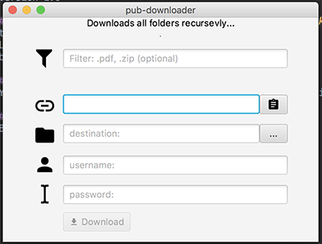

# README #

### Downloading files from the HAW "Pub" url [http://users.informatik.haw-hamburg.de/](http://users.informatik.haw-hamburg.de/) ###
* This simple app allows you to download files recursevly from the HAW "Pub" page in only one click!
* The folder structure, folder names and filenames are preserved as original.
* Version 1.0

### You can download the latest build [here](https://bitbucket.org/juanitolaguna/hawdownloader/downloads/pubLoader.zip) ####
* tested on Windows and OSX
* Linux? Try your luck!
* be sure Java 1.8 or higher is installed.

### How do I get set up? ###
* You can import it as Maven project to the IDE of your choice.

### Who do I talk to? ###
* Bugs? Suggestions?: little.pilgrim@mail.ru

